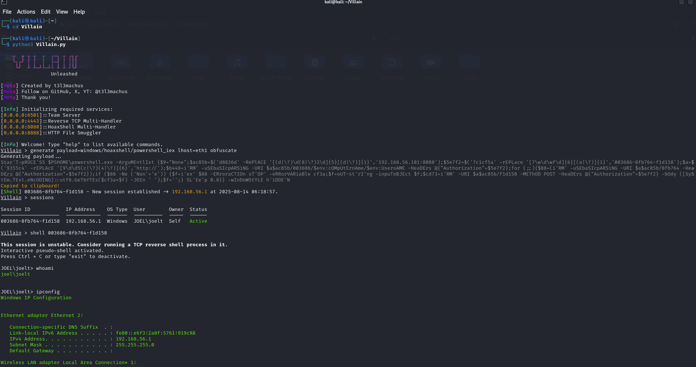
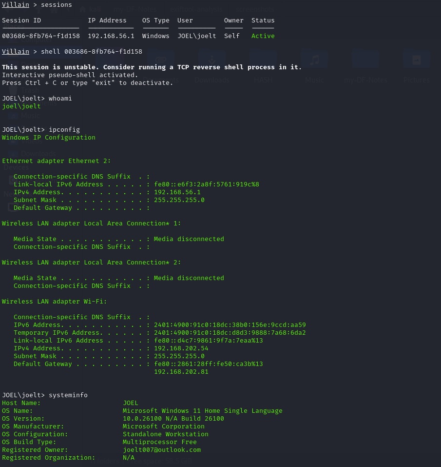
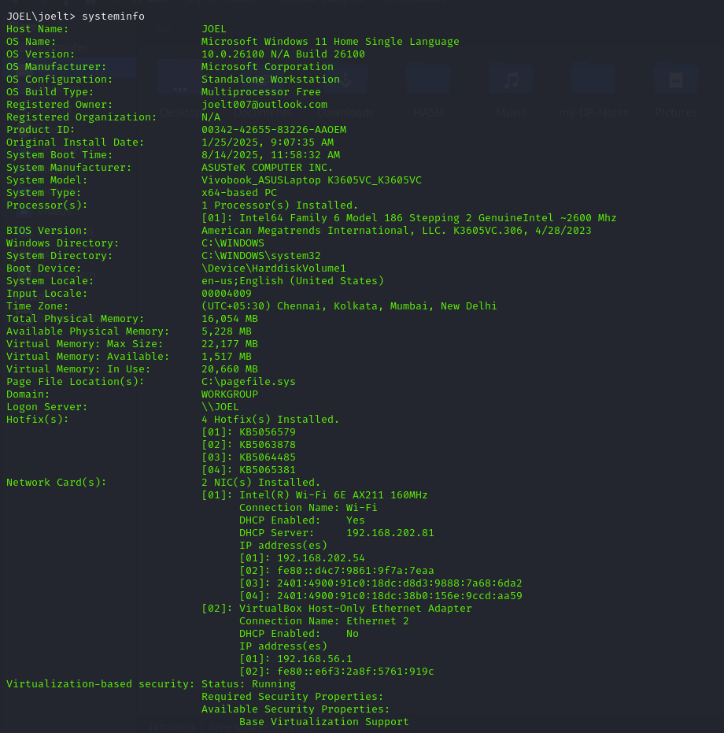
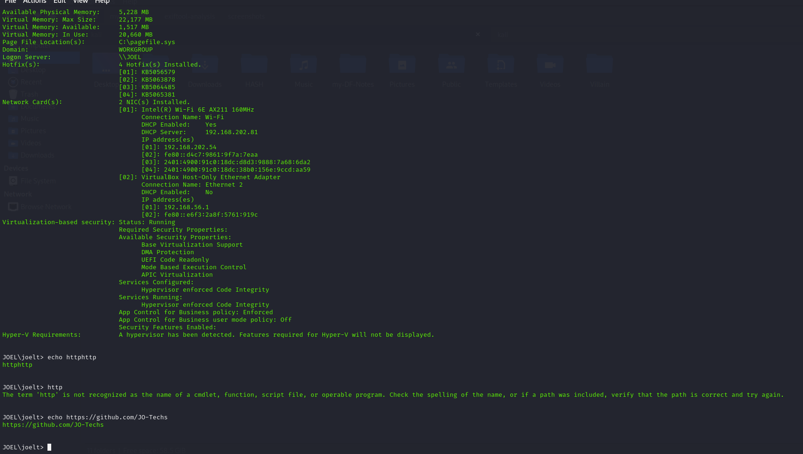

# Villain Framework Reverse Shell Report

## ⚙️ Setup Info
- **Payload:** `windows/reverse_tcp/powershell`
- **LHOST:** 192.168.56.101
- **LPORT:** 8080

## 🔁 Payload Delivery Method
The payload was generated using the Villain framework and executed on the target Windows 11 VM using an obfuscated PowerShell one-liner. The execution resulted in a reverse shell connection being established back to the attacker's listener.

> 📸 **Screenshot Placeholder:**  
> _Insert screenshot showing the payload generation and execution._

## 🖥️ Captured Info
- **Hostname:** JOEL
- **IP Address:** 
  - Ethernet (Host-Only): 192.168.56.1  
  - Wi-Fi: 192.168.202.54
- **User:** JOEL\joelt

## 🔎 Enumeration Performed

### Command Outputs

```powershell
whoami
ipconfig
systeminfo
```

## 🖼️ Screenshots




